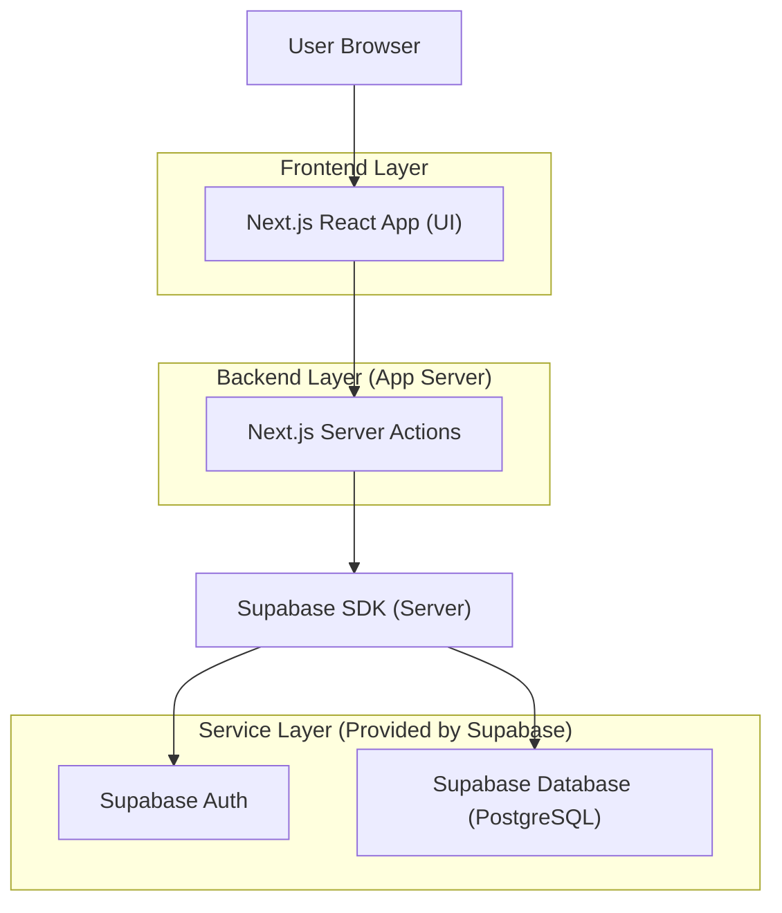
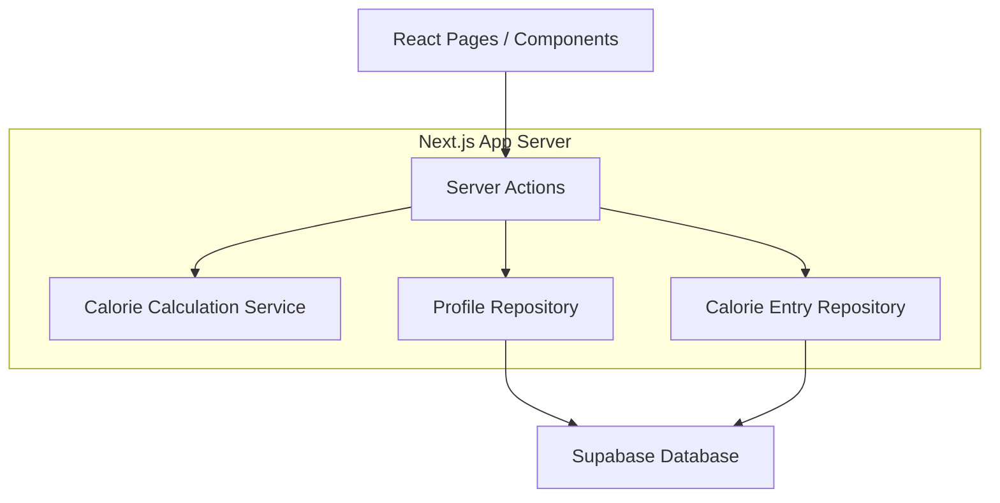
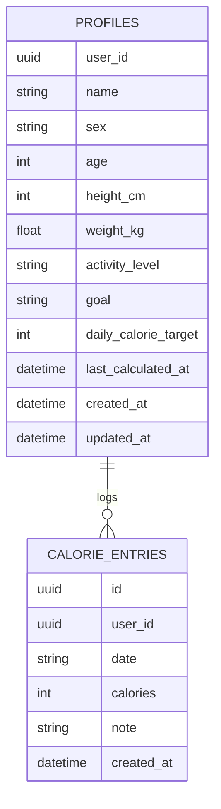

## 1.Architecture design


## 2.Technology Description
- Frontend: React@18 + Next.js (App Router) + TypeScript
- Backend: Next.js Server Actions
- Database/Auth: Supabase (PostgreSQL + Supabase Auth)

## 3.Route definitions
| Route | Purpose |
|---|---|
| /login | Sign up / sign in and establish session |
| /profile | Collect profile metrics; calculate + store daily calorie target |
| /dashboard | Show your name, stored daily calorie target, and today’s intake progress |

## 4.API definitions (If it includes backend services)
### 4.1 Shared TypeScript types
```ts
export type ActivityLevel = 'sedentary' | 'light' | 'moderate' | 'active' | 'very_active'
export type Goal = 'maintain' | 'cut' | 'bulk'

export type Profile = {
  user_id: string
  name: string
  sex: 'male' | 'female'
  age: number
  height_cm: number
  weight_kg: number
  activity_level: ActivityLevel
  goal: Goal
  daily_calorie_target: number | null
  last_calculated_at: string | null
  created_at: string
  updated_at: string
}

export type CalorieEntry = {
  id: string
  user_id: string
  date: string // YYYY-MM-DD
  calories: number
  note?: string | null
  created_at: string
}
```

### 4.2 Server Actions (conceptual)
- `calculateAndStoreDailyCalories(input: ProfileInput): Promise<{ daily_calorie_target: number }>`
  - Reads your profile inputs
  - Calculates target (e.g., BMR * activity multiplier, adjusted by goal)
  - Updates `profiles.daily_calorie_target` + `last_calculated_at`
- `addCalorieEntry(input: { date: string; calories: number; note?: string }): Promise<CalorieEntry>`
  - Inserts a row into `calorie_entries` for your user

## 5.Server architecture diagram (If it includes backend services)


## 6.Data model(if applicable)

### 6.1 Data model definition


### 6.2 Data Definition Language
Profiles (profiles)
```
CREATE TABLE profiles (
  user_id UUID PRIMARY KEY,
  name TEXT NOT NULL,
  sex TEXT NOT NULL,
  age INT NOT NULL,
  height_cm INT NOT NULL,
  weight_kg NUMERIC NOT NULL,
  activity_level TEXT NOT NULL,
  goal TEXT NOT NULL,
  daily_calorie_target INT,
  last_calculated_at TIMESTAMPTZ,
  created_at TIMESTAMPTZ DEFAULT NOW(),
  updated_at TIMESTAMPTZ DEFAULT NOW()
);

GRANT SELECT ON profiles TO anon;
GRANT ALL PRIVILEGES ON profiles TO authenticated;
```

Calorie entries (calorie_entries)
```
CREATE TABLE calorie_entries (
  id UUID PRIMARY KEY DEFAULT gen_random_uuid(),
  user_id UUID NOT NULL,
  date TEXT NOT NULL,
  calories INT NOT NULL,
  note TEXT,
  created_at TIMESTAMPTZ DEFAULT NOW()
);

CREATE INDEX idx_calorie_entries_user_date ON calorie_entries(user_id, date);

GRANT SELECT ON calorie_entries TO anon;
GRANT ALL PRIVILEGES ON calorie_entries TO authenticated;
```

Notes on access control (RLS recommended)
- Enable RLS on both tables.
- Policy idea: allow `authenticated` users to read/write rows where `user_id = auth.uid()`.
