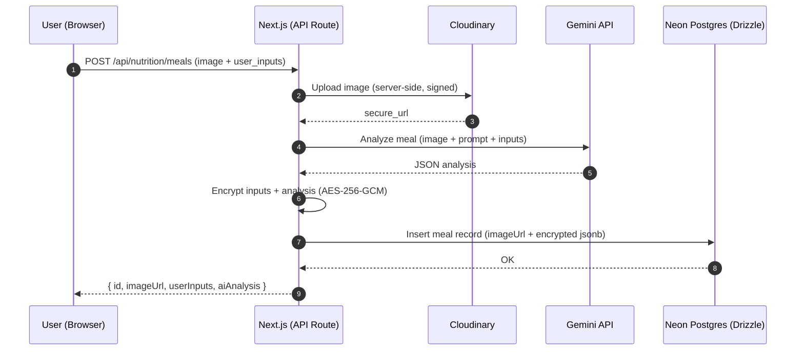
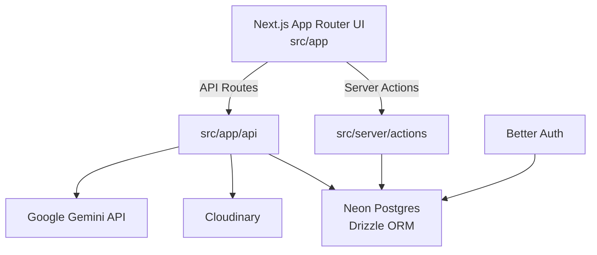

# Intlaq (انطلاق)

**Intlaq** is an Arabic-first, RTL-ready **productivity & wellness dashboard** that brings together **focus (Pomodoro)**, **habits**, **workouts**, and **AI-powered nutrition tracking** in one place.

- **Live Demo**: `https://intlaq.vercel.app/`

[](https://nextjs.org/)
[](https://react.dev/)
[](https://www.typescriptlang.org/)
[](https://vercel.com/)

---

## 🧠 Short Product Description

Intlaq helps you reach daily flow by combining health signals (nutrition + activity) with productivity signals (focus + habits) inside a single dashboard—built for Arabic UX from day one.

---

## 🧩 Problem & Solution

Most apps split your day across multiple tools: a timer, a habit tracker, a nutrition app, and a workout log. This fragmentation makes consistency hard.

**Intlaq** solves this by offering a unified dashboard that:
- Personalizes your daily calorie target after onboarding
- Lets you analyze meals via AI from a photo + inputs
- Centralizes your daily progress in one view

---

## ✨ Key Features

- **Arabic-first UX (RTL)** with responsive layout and modern UI
- **Authentication**
  - Email & password sign-up/sign-in (Better Auth)
  - Google OAuth
- **Onboarding & personalization**
  - Collects profile data (age/height/weight/activity/goal)
  - Calculates calorie targets (BMR/TDEE → daily calories)
- **Nutrition (AI)**
  - Upload a meal image + optional details (name, ingredients, notes, etc.)
  - Analyze calories & macros using **Google Gemini**
  - Store meal inputs + AI analysis **encrypted at rest**
  - Browse saved meals (paginated) and view full analysis JSON
- **Dashboard**
  - Daily calorie progress widget (live from DB + client cache)
  - Widgets for workouts / weight / habits / focus (some currently demo/stub data for UI)
- **Security**
  - **Rate limiting** for API routes and Server Actions (middleware)
- **Product polish**
  - Dark mode toggle
  - Vercel Analytics
  - Unit tests (Vitest)

---

## 🧰 Tech Stack

- **Framework**: Next.js (App Router), React, TypeScript
- **UI**: Tailwind CSS v4, shadcn/ui (Radix UI), Lucide, Sonner, Recharts
- **Auth**: Better Auth + Drizzle adapter
- **Database**: Neon Postgres + Drizzle ORM
- **AI**: Google Gemini (Generative Language API)
- **Media**: Cloudinary (secure server-side upload)
- **Email**: (verification email sending currently disabled)
- **State**: Zustand (lightweight client state)

---

## 🏗️ Architecture Overview

- **Routes/UI** live in `src/app/` (App Router)
- **API routes** in `src/app/api/`
- **Server Actions** in `src/server/actions/` (trusted server-side operations)
- **Database** access in `src/server/db/` using Neon + Drizzle
- **Nutrition AI utilities** in `src/server/utils/`
- **Rate limiting** in `middleware.ts` + `src/lib/rate-limit.ts`

---

## 🗺️ Diagram (High-Level)

### 🥗 Nutrition AI pipeline



### 🧱 App components



---

## 🛠️ Installation

### ✅ Prerequisites

- **Node.js 20+**
- A **Neon Postgres** database
- Cloudinary + Google credentials (OAuth + Gemini)

### 📦 Setup

```bash
git clone https://github.com/0xA7MD1/intlaq.git
cd intlaq
npm install
```

---

## 🔐 Environment Variables

Create a `.env` file in the project root:

```bash
# Database (Neon)
DATABASE_URL="postgres://..."

# Auth (Better Auth)
BETTER_AUTH_SECRET="change-me-to-a-long-random-secret"
baseURL="http://localhost:3000" # set to your production URL on Vercel

# Google OAuth
GOOGLE_CLIENT_ID="..."
GOOGLE_CLIENT_SECRET="..."

# AI (Gemini)
GEMINI_API_KEY="..."            # or set GOOGLE_API_KEY
# GOOGLE_API_KEY="..."
GEMINI_MODEL="gemini-2.0-flash" # optional (default: gemini-2.0-flash)
GEMINI_API_VERSION="v1"         # optional (default: v1)

# Cloudinary (server-side upload)
CLOUDINARY_URL="cloudinary://<api_key>:<api_secret>@<cloud_name>"

# Encryption (optional, recommended)
MEAL_DATA_ENCRYPTION_KEY="separate-strong-secret" # falls back to BETTER_AUTH_SECRET

# Rate limiting (optional)
RATE_LIMIT_API_PER_MINUTE=60
RATE_LIMIT_ACTIONS_PER_MINUTE=30

# Polar (AI credits via meters)
POLAR_ACCESS_TOKEN="..."
POLAR_WEBHOOK_SECRET="..."
POLAR_METER_NAME="..." # should match your Polar meter name
# Optional, defaults to sandbox
POLAR_SERVER="sandbox"
# Optional, defaults to 30 (granted per order.paid)
POLAR_CREDITS_PER_ORDER=30
# Product used for checkout (comma-separated if multiple)
POLAR_CREDITS_PRODUCT_ID="prod_xxx"
```

---

## 💳 Polar Credits (AI usage gating)

- **Webhook endpoint**: `POST /api/polar/webhook` (handles `order.paid`)
- **Checkout endpoint**: `GET /api/polar/checkout` (redirects to Polar checkout)
- **AI endpoint gated by credits**: `POST /api/nutrition/meals`

### Credit rules

- **Grant credits**: on `order.paid`, we ingest a Polar event with **negative units** (default: \(-30\)) which increases the meter balance.
- **Check before AI**: before any expensive work (Cloudinary/Gemini), we fetch the customer meter balance and block if `<= 0`.
- **Deduct after AI**: after successfully saving the meal, we ingest a Polar event with **positive units** (\(+1\)).

### Manual verification (sandbox)

1. **Set env**: `POLAR_ACCESS_TOKEN`, `POLAR_WEBHOOK_SECRET`, `POLAR_METER_NAME` (and optionally `POLAR_CREDITS_PER_ORDER`).
2. **Create a Polar customer** in sandbox with an email matching an existing `user.email` in your database.
3. **Send a test `order.paid` webhook** from Polar to your deployed webhook URL.
4. **Confirm user linkage**: the app stores `user.polarCustomerId` for that matching email.
5. **Try AI with 0 credits**:
   - Call `POST /api/nutrition/meals` as that user → should return `402` with `code: "INSUFFICIENT_CREDITS"`.
6. **Try AI after grant**:
   - After webhook grant, call `POST /api/nutrition/meals` again → should succeed.
   - Each successful call should reduce credits by 1.

7. **End-to-end checkout**:
   - Configure `POLAR_CREDITS_PRODUCT_ID` with your Polar product ID for credits.
   - From the Nutrition page, click “شراء رصيد للتحليلات” to open Polar checkout.
   - After completing payment, Polar sends `order.paid` → credits are granted via webhook.

## 🧪 Database & Migrations

SQL migrations live in `migrations/`:
- `migrations/0001_add_calorie_profile_and_entries.sql`
- `migrations/0002_add_meals_table.sql`

Apply them to your Postgres database using your preferred method (Neon SQL Editor, `psql`, etc.).

---

## 🏃 Running Locally

```bash
npm run dev
```

Open `http://localhost:3000`.

### 🧾 Useful Scripts

```bash
npm run lint
npm run typecheck
npm test
npm run build
npm run start
```

---

## 🚀 Deployment

**Recommended**: Vercel

- Import the repository into Vercel
- Add the environment variables from the section above
- Ensure migrations are applied to your Neon database
- Deploy

---

## 🗂️ Folder Structure

```txt
.
├── migrations/
│   ├── 0001_add_calorie_profile_and_entries.sql
│   └── 0002_add_meals_table.sql
├── src/
│   ├── app/
│   │   ├── api/
│   │   │   ├── auth/[...all]/route.js
│   │   │   └── nutrition/meals/route.ts
│   │   ├── (dashboard)/dashboard/
│   │   │   ├── layout.tsx
│   │   │   ├── page.tsx
│   │   │   ├── nutrition/page.tsx
│   │   │   └── habits/page.tsx
│   │   ├── layout.tsx
│   │   └── page.tsx
│   ├── components/
│   │   ├── auth/
│   │   ├── dashboard/
│   │   ├── features/nutrition/
│   │   ├── layout/
│   │   ├── providers/
│   │   └── ui/
│   ├── lib/
│   │   ├── auth.ts
│   │   ├── auth-client.ts
│   │   └── rate-limit.ts
│   ├── server/
│   │   ├── actions/
│   │   ├── db/
│   │   └── utils/
│   ├── store/
│   └── types/
├── drizzle.config.ts
├── middleware.ts
├── next.config.js
└── package.json
```

---

## 🧭 Future Improvements

- Persist **habits / focus sessions / workouts / weight history** in the database (currently some widgets are demo/stub data)
- Compute “Daily Summary” from actual stored meals + calorie entries (currently illustrative UI)
- Add CI workflows (lint/typecheck/test) and an automated migration strategy
- Add i18n (EN/AR) and deeper accessibility audits

---

## 👤 Author

Built by **A7MD** ([@0xA7MD1](https://github.com/0xA7MD1)).
